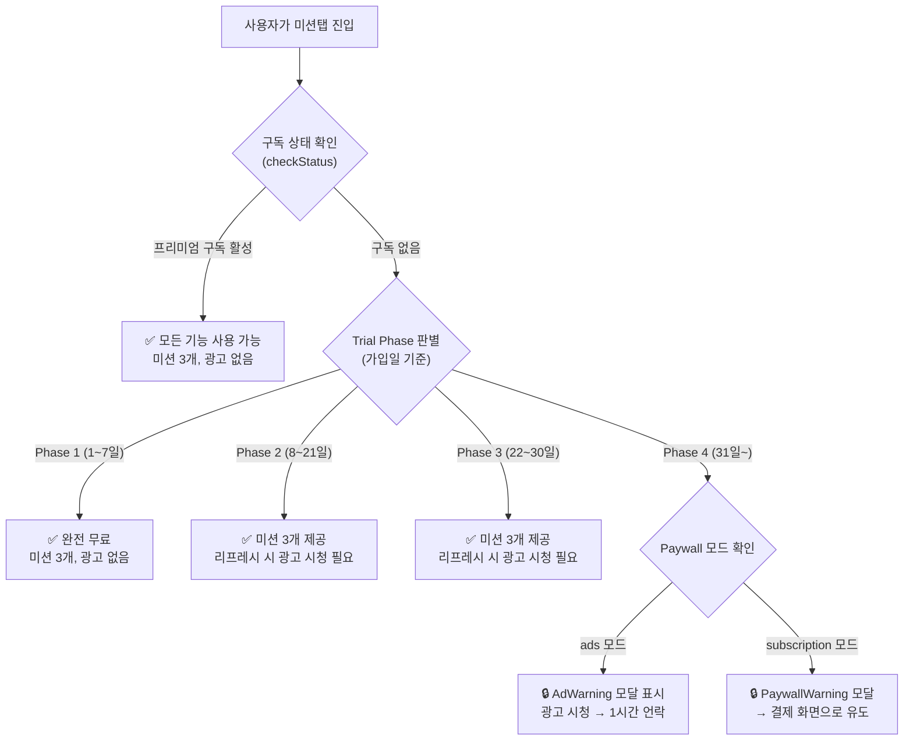
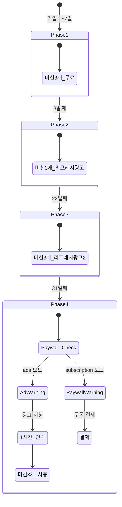

# 미션탭 무료/프리미엄 정책 및 광고 로직 분석

## 전체 흐름 요약



---

## 1. Trial Phase (무료 체험 4단계)

[Today.tsx L100~170](file:///c:/calamusAppBuild/MyReDesign_App/src/pages/Home/Today.tsx#L100-L170) 에서 구현됩니다.

| Phase | 기간 | 미션 수 | 광고 | 설명 |
|-------|------|---------|------|------|
| **Phase 1** | 1~7일 | 3개 | ❌ 없음 | 완전 무료, 모든 기능 접근 |
| **Phase 2** | 8~21일 | 3개 | 리프레시 시만 | 미션 변경(Refresh) 시 광고 시청 필요 |
| **Phase 3** | 22~30일 | 3개 | 리프레시 시만 | Phase 2와 동일 (이전에는 1개 제한이었으나 변경됨) |
| **Phase 4** | 31일~ | **0개 (잠금)** | ⚠️ Paywall 활성 | 구독 또는 광고 시청 필수 |

> [!IMPORTANT]
> Trial 일수는 **선택된 목표의 `created_at`** 기준으로 계산됩니다 (fallback: 프로필 생성일)

```typescript
// L122~L126
if (diffDays <= 7) setTrialPhase(1);
else if (diffDays <= 21) setTrialPhase(2);
else if (diffDays <= 30) setTrialPhase(3);
else setTrialPhase(4);
```

---

## 2. 구독 확인 로직 (checkStatus)

[Today.tsx L136~166](file:///c:/calamusAppBuild/MyReDesign_App/src/pages/Home/Today.tsx#L136-L166)

`subscriptions` 테이블에서 현재 유효한 구독을 확인합니다:

| 조건 | 결과 |
|------|------|
| `type = 'all'` + 날짜 범위 내 | ✅ **모든 카테고리** 접근 가능 |
| `type = 'mission'` + `target_id` 매칭 | ✅ **해당 카테고리만** 접근 가능 |
| 해당 없음 | ❌ Trial Phase에 따라 제한 |

---

## 3. Paywall 활성화 조건

[Today.tsx L772](file:///c:/calamusAppBuild/MyReDesign_App/src/pages/Home/Today.tsx#L772)

```typescript
const isPaywallActive = !loading 
    && !checkingSubs 
    && !hasActiveSubscription   // 구독 없음
    && !isFunplay               // FunPlay가 아님 (FunPlay는 항상 무료)
    && trialPhase === 4         // 31일 이상 경과
    && !isAdUnlocked            // 광고 시청 언락 안 됨
    && !hasConfirmedMissions;   // 이미 확인된 미션 없음
```

**모든 조건이 충족되면** → `paywallStep = 'warning'` 설정 → 모달 표시

---

## 4. Paywall 모드 분기 (ads vs subscription)

[Today.tsx L860~890](file:///c:/calamusAppBuild/MyReDesign_App/src/pages/Home/Today.tsx#L860-L890)

`admin_settings` 테이블의 `paywall_mode` 값에 따라 분기:

### 4-1. 광고 모드 (`ads`)

```
AdWarning 모달 → "광고 시청" 클릭 → RewardAd 표시 → 시청 완료 → 1시간 언락
                → "프리미엄 가입" 클릭 → Paywall 결제 화면
```

### 4-2. 구독 모드 (`subscription`)

```
PaywallWarning 모달 → "확인" 클릭 → Paywall 결제 화면
                    → "취소" 클릭 → FunPlay 또는 구독된 다른 목표로 이동
```

---

## 5. 광고 시청 후 언락 로직

[Today.tsx L842~856](file:///c:/calamusAppBuild/MyReDesign_App/src/pages/Home/Today.tsx#L842-L856)

```typescript
const handleAdReward = () => {
    setIsAdUnlocked(true);
    // 1시간 쿨다운 저장 (localStorage)
    const key = `ad_unlocked_${user.id}_${selectedGoalId}_${selectedDate}`;
    localStorage.setItem(key, Date.now().toString());
    // 대기 중이던 리프레시 실행
    if (pendingRefresh) executeRefresh();
};
```

| 항목 | 값 |
|------|-----|
| 유효 시간 | **1시간** |
| 저장 위치 | `localStorage` (세션 기반) |
| Key 형식 | `ad_unlocked_{userId}_{goalId}_{date}` |
| 적용 범위 | 해당 목표 + 해당 날짜에만 적용 |

---

## 6. 미션 리프레시 광고 강제

[Today.tsx L453~476](file:///c:/calamusAppBuild/MyReDesign_App/src/pages/Home/Today.tsx#L453-L476)

```typescript
const handleRefresh = async () => {
    if (refreshCount >= 3) return; // 일일 3회 제한

    // 무료 사용자 → 광고 먼저 시청
    if (user?.subscription_tier !== 'premium' && !hasActiveSubscription) {
        setPendingRefresh(true);
        setShowRewardAd(true);  // 광고 표시
        return;
    }
    // 프리미엄 → 바로 실행
    executeRefresh();
};
```

| 사용자 유형 | 리프레시 동작 |
|-------------|---------------|
| **프리미엄 구독자** | 바로 리프레시 (일일 3회) |
| **무료 사용자** | 광고 시청 후 리프레시 (일일 3회) |

---

## 7. FunPlay 예외 정책

- **FunPlay 카테고리는 항상 무료**입니다
- Paywall이 활성화되어도 FunPlay 목표는 잠기지 않음 (`!isFunplay` 조건)
- Paywall 취소 시 FunPlay 목표가 있으면 자동으로 이동됨

---

## 8. 미션 수 제한 로직

[Today.tsx L350~372](file:///c:/calamusAppBuild/MyReDesign_App/src/pages/Home/Today.tsx#L350-L372)

```typescript
let limit = 3;
// 완료된 미션은 항상 표시 + 남은 슬롯에 미완료 미션 채움
const completedMissions = relevantMissions.filter(m => m.is_completed);
const incompleteMissions = relevantMissions.filter(m => !m.is_completed);
const showList = [...completedMissions];
const remainingSlots = Math.max(0, limit - showList.length);
showList.push(...incompleteMissions.slice(0, remainingSlots));
```

> [!NOTE]
> 이전에는 Phase 3에서 미션 1개로 제한했었으나, **현재는 Phase 1~3 모두 3개로 통일**되어 있습니다. Phase 4에서는 Paywall이 먼저 차단하므로 미션 자체가 표시되지 않습니다.

---

## 요약 다이어그램


